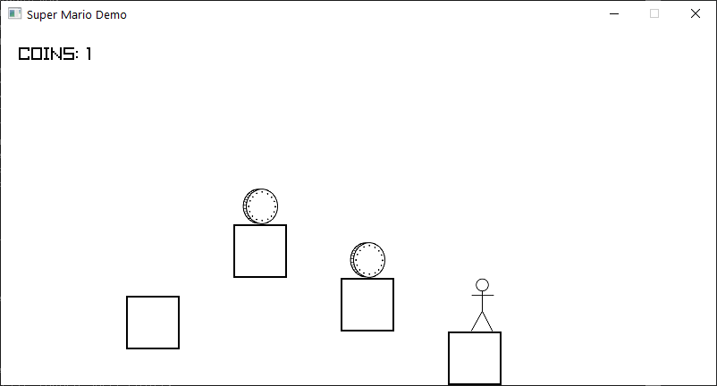

# Raylib Demo

A simple platformer demo using Raylib & C++.

`KEY A` and `KEY D` for moving left and right. `KEY W` for jumping.

Character can land on the floor while falling and automatically start falling while walk out of the floor.

The falling physics now works exactly as expected.

